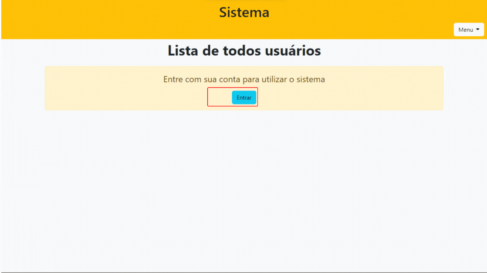

<h1 align="center"> Sistema de gerenciamento de usuários </h1>

  

# Índice 

* [Descrição do Projeto](#descrição-do-projeto)
* [Funcionalidades e Demonstração da Aplicação](#funcionalidades-e-demonstração-da-aplicação)
* [Acesso ao Projeto](#acesso-ao-projeto)
* [Tecnologias utilizadas](#tecnologias-utilizadas)
* [Pessoas Desenvolvedoras do Projeto](#pessoas-desenvolvedoras)
* [Licença](#licença)
* [Conclusão](#conclusão)

# 
 Descrição do Projeto 

 Sistema de gerenciamento de usuários podendo atribuir permissões aos indivíduos pertencentes à sua conta, sendo recomendável que você atribua a função de Administrador de Sistema da sua conta a mais de um usuário, para o caso do administrador principal não estar disponível. 

# 
 :hammer: Funcionalidades do projeto 

* Tutorial de utilização do sistema

 
   

# 
 :file_folder: Acesso ao Projeto 

Você pode acessar os arquivos do projeto clicando [aqui.](https://sistema-gerenciador-usuarios.herokuapp.com)

# 
 :heavy_check_mark: Tecnologias Utilizadas 

* `HTML`
* `CSS`
* `Javascript`
* `MongoDB`
* `Express.js`
* `Ejs`

# 
 Autor 

[ Mikaelisson Gesuino](https://github.com/Mikaelisson)
| :---: |